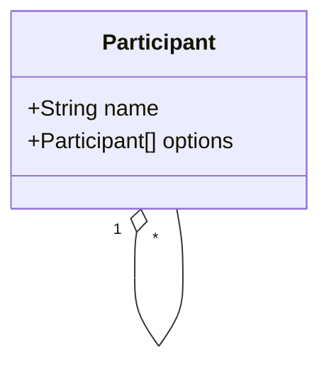

Ouihelp's Secret Santa
===


<a href="http://www.freepik.com">Designed by Freepik</a>

This project is homework for my application at the French company named [Ouihelp](https://www.ouihelp.fr/).

# Subject
A group of demanding friends gather for Christmas and would like to exchange gifts anonymously.

Write a piece of software that processes the list of participants so each person knows who make
a gift to. The friends are picky so the software must abide by these rules:
1. each person must make and receive exactly one gift;
2. a recipient does not make a gift to his source;
3. couples must not give gifts to one another.

# Implementation
I considered the “couple contraint” a generic “exclusion constraint” so the mechanism is easier
to extend later. This mean one can add as many pairs of names as one wants.

The program runs in three steps that are run sequentially.

First it parses and cleans the inputs (blank lines, trailing whitespaces) from the given text files.
Data are then modelled into Python objects.
They form a __graph__ of all the participants and the recipient they could be giving gifts to.



Second, it looks for participants with __only one recipient option__ and "secures" this option.
Securing means removing the option to everyone but the participant that has no other choice.

Finally it runs a backtracking algorithm to find a suitable path through all the participants.

## Inputs & Outputs
This script processes __two text files__ and outputs the required sorting in a __third text file__.

The first text file contains a list of all participant names, one per line. The second file
contains the names of participants that must not be giving gifts to one another. Each line contains
a pair of names, separated by a comma.

Once the program successfuly finds a convenient path through the graph, it writes all the pairs it
made into an output file.
Beware, this output file is erased on program's opening.

Examples have been committed into this repo:
```shell
# Input files
datasets/family.txt
datasets/family_exclusions.txt

# Output file
datasets/family_sorting.txt
```

## Run
This project is using only the standard Python library. Still, there is a Dockerfile to run it
independently. Here are build and run commands:
```shell
$ docker build -t ouihelp_secret_santa:dev .
$ docker run --rm -it ouihelp_secret_santa:dev sh
# Now from the container's shell
$ python -m secret_santa.main datasets/family.txt datasets/family_exclusions.txt datasets/family_sorting.txt
Got 14 name(s) from "datasets/family.txt".
Got 13 exclusion(s) from "datasets/family_exclusions.txt".
Prepping datasets…
Securing participants with limited options…
Working Santa's magic…
Hurray! Santa sorted things out in "datasets/family_sorting.txt".

# Having a look at the output:
$ cat datasets/family_sorting.txt
Paul       makes a gift to Mia.
Mia        makes a gift to Elodie.
Elodie     makes a gift to Elena.
Elena      makes a gift to Alexis.
Alexis     makes a gift to Cléo.
Cléo       makes a gift to Matthieu.
Matthieu   makes a gift to Batiste.
Batiste    makes a gift to Nelly.
Nelly      makes a gift to Maïté.
Maïté      makes a gift to Laurent.
Laurent    makes a gift to Yann.
Yann       makes a gift to Mickaël.
Mickaël    makes a gift to Luc.
Luc        makes a gift to Paul.
```

## Tests
Some unit tests are to be run in `secret_santa/test_lib.py`.
```shell
$ docker run --rm -it ouihelp_secret_santa:dev sh
# Now from the container's shell
$ python -m unittest discover -s secret_santa/ --failfast -vv
```

One can also check PEP8 coding convention usage running Flake8.
```shell
flake8 --max-line-length=100
```

# How to improve?
* Add advanced formats for input and output files, such as CSV or JSON.
* Add a flag to output sorting to the console (`--output`).
* Add intentional randomness (`--random` flag) so order in the input files is of no importance.
* Add a "do your best" flag to reach a result even when no convenient path can be found. The program would gradually drop constraints until a result is produced.
* Add emailing support.
